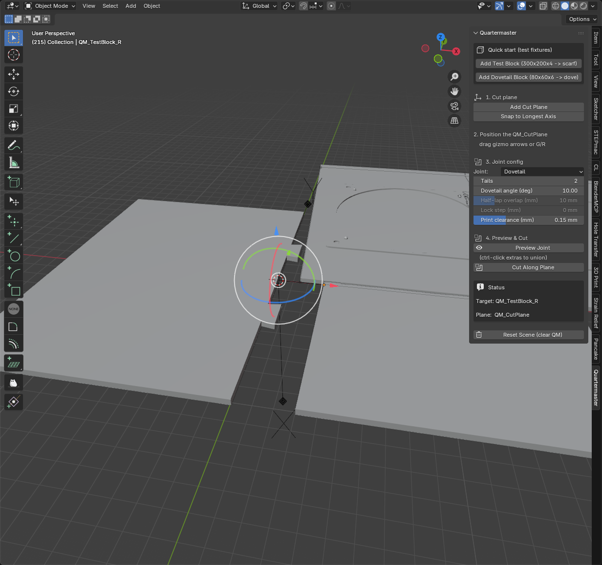

# Quartermaster

[](https://github.com/gyasis/quartermaster/actions/workflows/ci.yml)

Auto-split prints that exceed your build plate, with the right joinery for the stock thickness — a Blender add-on.



## What it does

Take a model too big for your printer's build plate. Drop a cut-plane Empty into the scene, drag it to the seam location, click **Cut Along Plane**. Quartermaster:

1. **Bakes the modifier stack** of the target so the cut acts on what you see, not the raw mesh (a Solidify modifier turning a 4-vert quad into a 3 mm plate stays a plate)
2. **Unions any other selected meshes** with the target — for assemblies built from multiple objects (plate + bosses, fixture + tabs, etc.)
3. **Measures stock thickness at the cut intersection** by bisecting the part with the cut plane — *not* from the AABB. Asymmetric assemblies (plate with a tall boss far from the cut) get joints sized to the local plate, not to the boss extent
4. **Picks the joint family** from a 2-axis decision matrix (thickness × seam length)
5. **Generates the joinery** — cut surface, alignment pins (scarf), tabled lock step (scarf), trapezoidal tail (dovetail), rectangular fingers (finger / box), Z-step (half-lap), or sliding tenon (sliding dovetail)
6. **Applies FDM clearance** (default 0.15 mm per side) so the printed pieces slot together with a real-world tolerance gap
7. **Splits the model** into two halves with the joinery baked in. Both halves are clean closed solids you can export to STL

## Joint matrix

|                       | Short seam (< 100 mm) | Medium (100-300 mm)             | Long (> 300 mm)         |
|-----------------------|-----------------------|---------------------------------|-------------------------|
| **< 3 mm thickness**  | scarf 12:1            | scarf 12:1 + pins               | scarf 12:1 + pins       |
| **3-5 mm**            | dovetail              | **scarf 8:1 + pins** _(default)_| finger                  |
| **5-8 mm**            | dovetail              | finger                          | finger                  |
| **>= 8 mm**           | box                   | sliding dovetail                | sliding dovetail        |

See [docs/joints.md](docs/joints.md) for one section per joint type with images, parameters, and when to use each.

## Workflow inside Blender

Look for the **Quartermaster** tab in the 3D viewport's N-panel (press `N` if hidden).

1. **Add Test Block** (or pick your own mesh) — drops a clean 300×200×4 mm cuboid for trying things out
2. **Add Cut Plane** — places a `QM_CutPlane` Empty with transform gizmos active. Optionally **Snap to Longest Axis** to align it perpendicular to the part's longest edge
3. Drag the gizmo arrows or press G / R to position the cut where you want
4. Pick a joint type (or leave on **Auto** to use the picker), tune **Print clearance** if needed
5. Optional: **Preview Joint** to see the cut path as a wireframe overlay before committing
6. Select the target mesh (ctrl-click any extras to union them in), click **Cut Along Plane**

Re-running the cut cleanly replaces the prior `_L` / `_R` / `_baked` outputs — iterate as much as you want. **Reset Scene (clear QM)** at the bottom of the panel removes everything Quartermaster created, leaving your own meshes alone.

## Architecture

```
src/quartermaster/
├── joint_strategy.py        # picker brain — the 2-axis matrix
├── plane.py                 # CutPlane abstraction (plane-agnostic)
├── joints/
│   ├── scarf.py             # smooth and tabled scarf paths + alignment pins
│   ├── dovetail.py          # trapezoidal tail path (single + multi-tail)
│   ├── finger.py            # rectangular finger path (parameterized by pitch)
│   ├── box.py               # rectangular finger path (parameterized by count)
│   ├── half_lap.py          # Z-shape lap path
│   ├── sliding_dovetail.py  # trapezoidal tenon profile
│   └── preview.py           # unified wireframe preview generator
└── blender/
    ├── adapter.py           # Empty-as-cut-plane + evaluated-mesh handling
    ├── cut.py               # cut pipeline: bisect cross-section, dispatch on joint
    ├── operators.py         # Add Test Block, Add Cut Plane, Snap, Preview, Cut, Reset
    ├── panel.py             # N-panel UI
    └── fixtures.py          # parametric test-block fixtures
```

`joint_strategy`, `plane`, and everything under `joints/` are **bpy-free** — they import only stdlib and run in plain pytest. Only `blender/` imports `bpy`.

## Status

148 unit tests, 84 Blender smoke checks, all green on every push (CI runs both jobs):

| Joint | Picker | Override | Tolerance | Asymmetric assemblies |
|---|:-:|:-:|:-:|:-:|
| Scarf (smooth + tabled) | ✓ | ✓ | n/a (bisect) | ✓ |
| Dovetail (single + multi-tail) | ✓ | ✓ | ✓ | ✓ |
| Finger | ✓ | ✓ | ✓ | ✓ |
| Box | ✓ | ✓ | ✓ | ✓ |
| Half-lap | _(override-only)_ | ✓ | _no_ | ✓ |
| Sliding dovetail | ✓ | ✓ | ✓ | ✓ |

## Development

Unit tests (no Blender required):

```sh
uv run --with pytest pytest -v
```

Headless Blender smoke test (after `blender --version` confirms Blender 4.x is on your `$PATH`):

```sh
blender --background --python scripts/blender_smoke.py
```

The smoke test exercises every operator end-to-end on real meshes and asserts on output geometry. CI runs the same script on every push (see [`.github/workflows/ci.yml`](.github/workflows/ci.yml)).

## Install

Two install paths depending on your Blender version. Both download from the same [Releases page](https://github.com/gyasis/quartermaster/releases):

**Blender 4.2+ (extension format, recommended)** — download `quartermaster-extension.zip`. In Blender:

> _Edit → Preferences → Get Extensions → ⌄ → Install from Disk..._ → select the zip.

**Blender 4.0 / 4.1 (legacy add-on)** — download `quartermaster.zip`. In Blender:

> _Edit → Preferences → Add-ons → Install..._ → select the zip → enable the **Quartermaster** checkbox.

**From source** (for hacking): clone the repo and build the zips yourself.

```sh
git clone https://github.com/gyasis/quartermaster.git
cd quartermaster
./scripts/build_addon.sh
# Outputs dist/quartermaster.zip (legacy) and dist/quartermaster-extension.zip
```

**Dev mode** (no install — useful when iterating on the code): in Blender's Python console,

```python
import sys
sys.path.insert(0, "/absolute/path/to/quartermaster/src")
import quartermaster
quartermaster.register()
```
