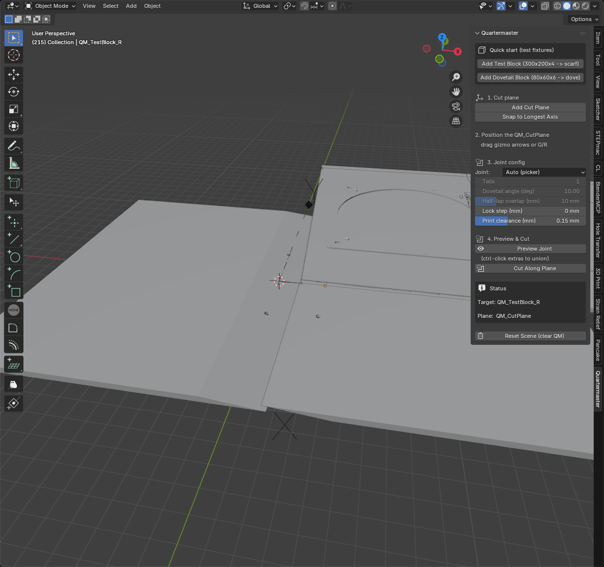
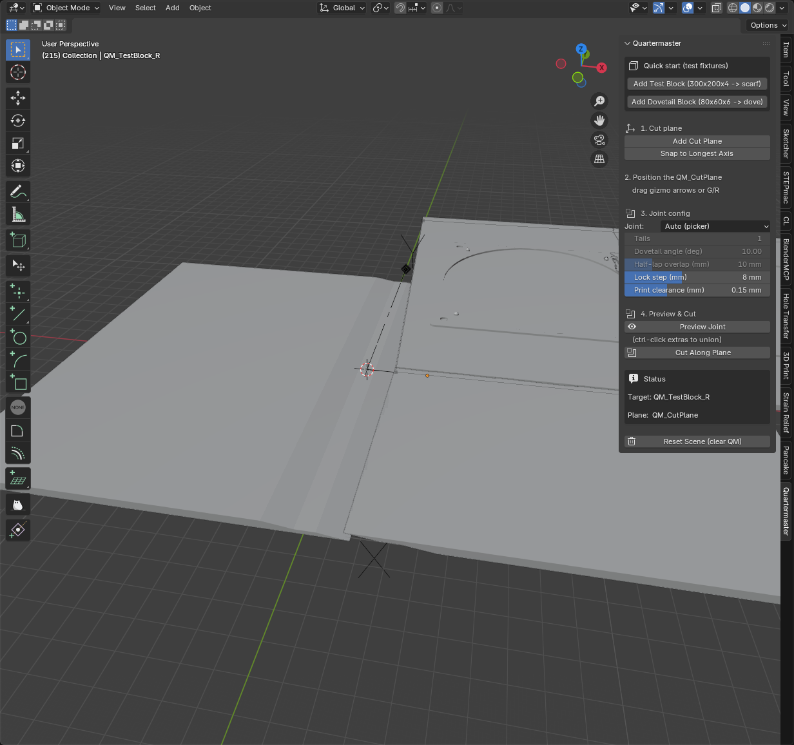
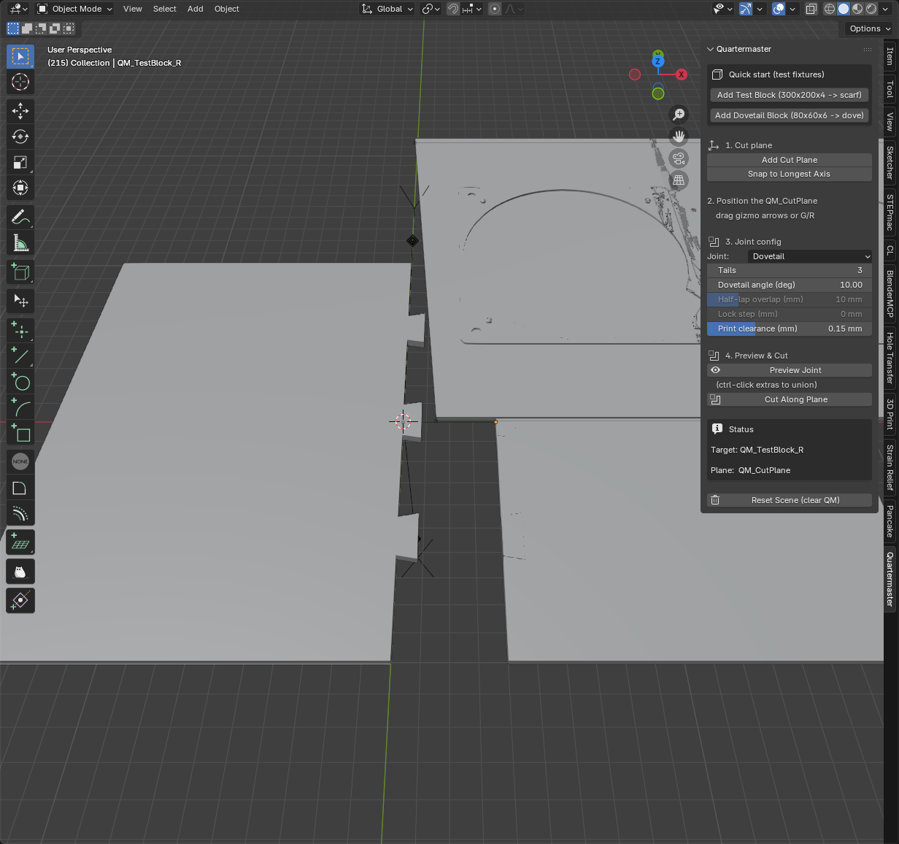
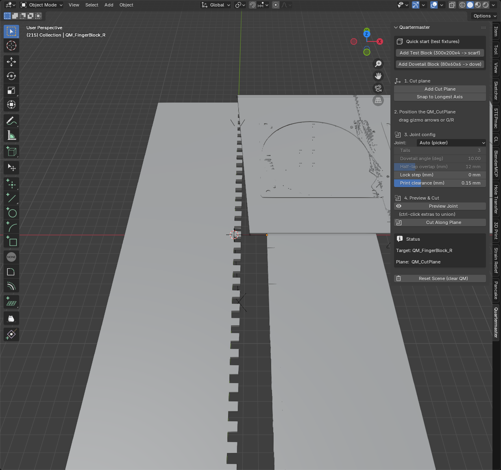
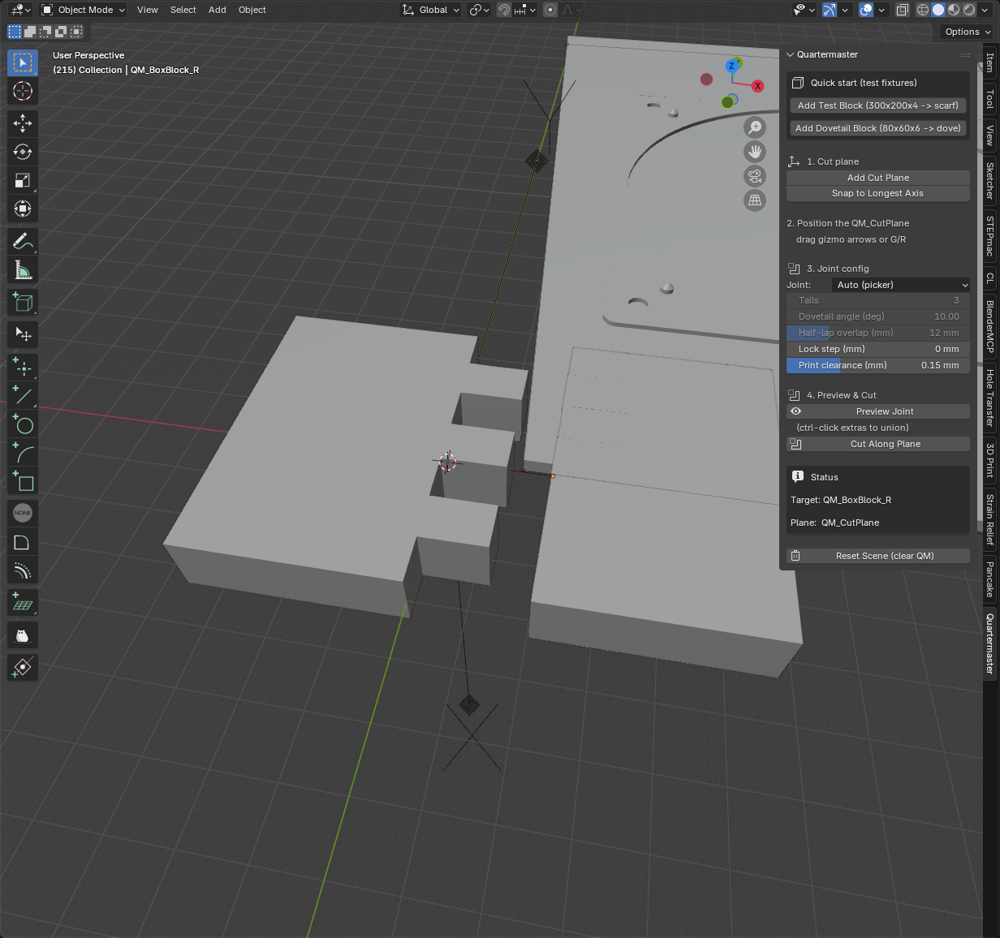
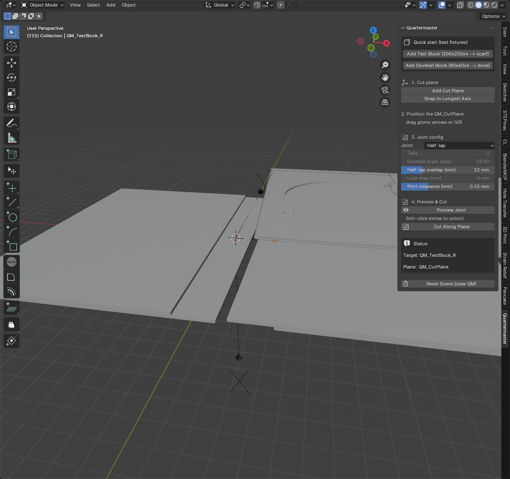
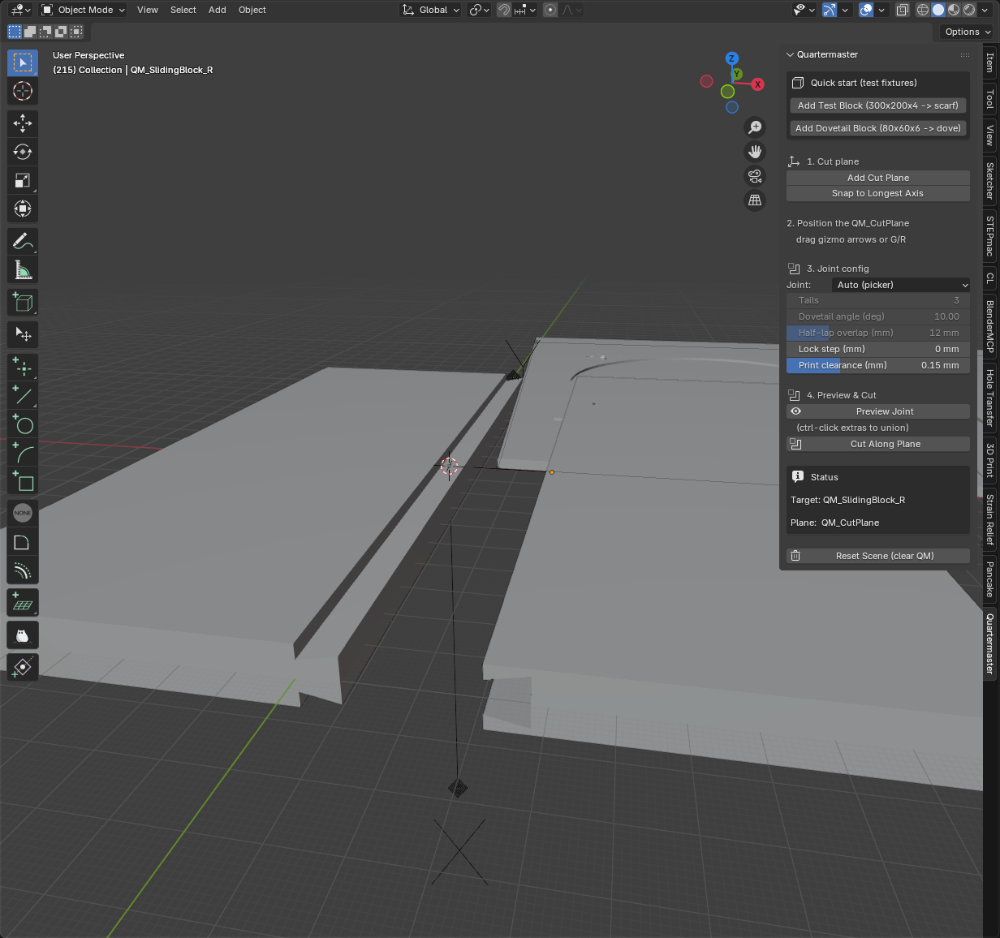

# Joints

Quartermaster picks one of these joint families based on the stock thickness
**at the cut location** (measured by bisecting the part with the cut plane,
not the AABB) and the length of the seam. The matrix below is what the
picker returns by default; you can also force any joint type from the
**Joint** dropdown in the panel.

## The picker matrix

|                          | Short seam (< 100 mm) | Medium (100-300 mm)         | Long (> 300 mm)         |
|--------------------------|-----------------------|-----------------------------|-------------------------|
| **< 3 mm thickness**     | scarf 12:1            | scarf 12:1 + pins           | scarf 12:1 + pins       |
| **3-5 mm**               | dovetail              | **scarf 8:1 + pins** _(default)_ | finger              |
| **5-8 mm**               | dovetail              | finger                      | finger                  |
| **>= 8 mm**              | box                   | sliding dovetail            | sliding dovetail        |

Each joint also accepts a per-side **print clearance** (`tolerance_mm`,
default 0.15 mm) — the socket prism is offset outward by that amount so the
printed pieces slot together on FDM with the right gap.

---

## Scarf

Diagonal cut through the stock thickness with `overlap_mm = ratio × thickness`
of overlap. **Scarf 8:1** (overlap = 8 × thickness) is the picker's default
for medium-length seams in 3-5 mm stock — the joint with the largest glue
surface that's still simple to print.

For very thin stock (< 3 mm) the picker switches to **scarf 12:1** so the
overlap is long enough to keep glue area meaningful when each half is only
~half the original thickness.

Two **alignment pin holes** (Ø3 mm, drilled perpendicular to the scarf face)
are added when the seam is medium or long, so the printed halves register
during glue-up.

---

## Tabled scarf (lock scarf)

Scarf with an extra perpendicular step at mid-thickness. The step
mechanically locks against in-plane pull and self-registers during glue-up,
trading some tolerance for grip. Set **Lock step (mm)** in the panel to
enable; 0 leaves the scarf smooth.

---

## Dovetail

Trapezoidal flares along the seam. The flare resists pull-out: once
assembled, you can only separate the halves by sliding along the seam axis,
not pulling perpendicular to it.

Picker uses dovetail for **short seams in 3-8 mm stock** with a single
centered tail. You can override **Tails** in the panel to get 2, 3, … evenly
distributed flares for longer seams. Override **Dovetail angle (deg)** to
trade flare strength against FDM tolerance (7-10° is the sweet spot on most
slicers).

---

## Finger joint

Rectangular fingers (no flare) repeated along the seam. Picker uses finger
joints for **long seams in 3-8 mm stock**, where many small features
self-align over distance better than one big dovetail.

Held together by glue + friction; no mechanical pull-out resistance.

---

## Box joint

Box joints are finger joints parameterized by an explicit **finger count**
(default 3) instead of a pitch. Picker uses box for **short seams in
≥ 8 mm stock**, where a few large fingers fit better than dozens of small
ones.

Default `depth_mm = thickness` produces square fingers — the classic
box-joint look.

---

## Half-lap

The simplest mechanical joint: each half keeps half its thickness across an
**overlap** distance, on opposite faces. They interlock at z=0 with
substantial glue area but no flare or pull-out resistance — pure friction
and adhesive.

Override only — the picker doesn't choose half-lap by default. Useful when
you specifically want the glue surface and don't care about mechanical
locking. Set **Half-lap overlap (mm)** in the panel.

---

## Sliding dovetail

A dovetail rotated 90° — the trapezoidal flare is in the *thickness*
direction instead of along the seam. The tenon runs the full seam length
and the two halves slide together along the seam axis. The flare locks
against pull-out perpendicular to the seam.

Picker uses sliding dovetail for **medium-to-long seams in ≥ 8 mm stock**
where there's enough thickness to make the trapezoid mechanically strong
without compromising printability.
